# Project 4 — TicTacToe RL (Monte Carlo, Q-Learning, DQN/DDQN)

## Answers (by category)

### 1) Monte Carlo

#### Actual W&B runs (used for the observations below)

| run | learning_rate | discount_factor | epsilon | episodes | runtime |
| --- | --- | --- | --- | --- | --- |
| quiet-glade-3 | 0.0001 | 0.05 | 0.1 | 100000 | 25m 30s |
| leafy-bird-2 | 0.0001 | 0.99 | 0.1 | 100000 | 1h 29m 59s |
| fresh-cosmos-1 | 0.001 | 0.99 | 0.1 | 100000 | 43m 13s |

#### Visuals (from W&B)

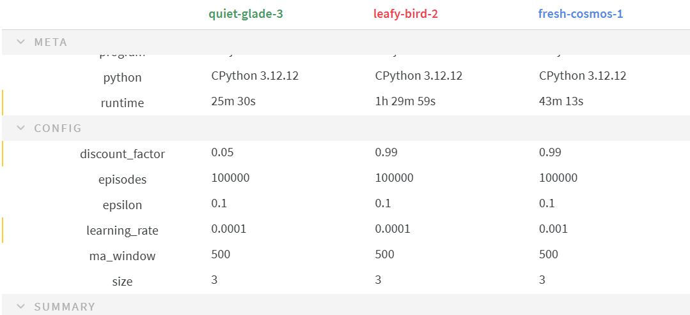

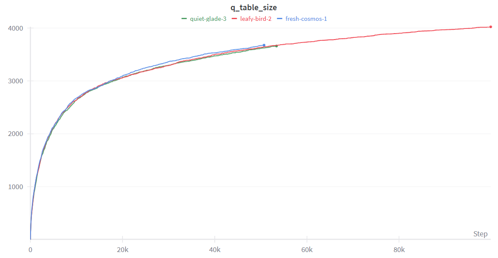

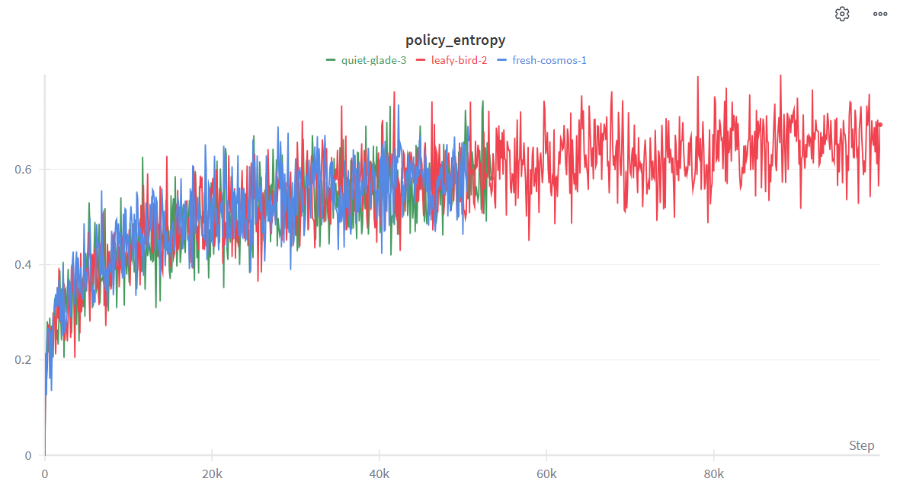

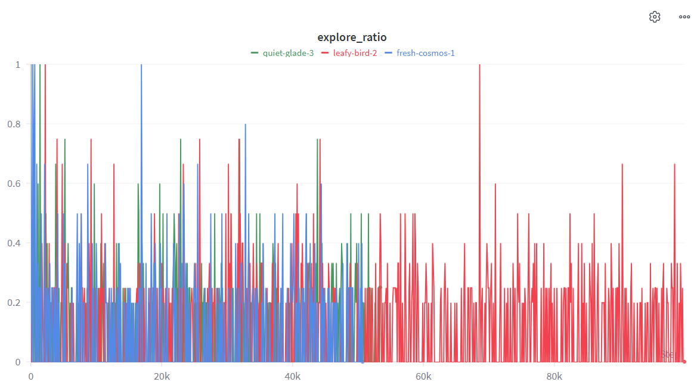

#### Learning Rate
- **Observed in your runs (same discount_factor=0.99)**
  - `fresh-cosmos-1` (learning_rate=0.001) reaches the same Q-table scale as the slower run earlier and appears to stop around ~55k steps, suggesting faster convergence / earlier plateau under the notebook’s early-stopping logic.
  - `leafy-bird-2` (learning_rate=0.0001) runs much longer (to ~100k), keeps growing the Q-table and keeps policy entropy fluctuating upward, indicating slower convergence.
- **Interpretation**
  - Increasing learning rate tends to speed up learning and reduce wall-clock time to reach a stable policy.
  - Too high can add variance/instability, but in this run set the higher LR mainly improved time-to-plateau.

#### Discount Factor
- **Observed in your runs (same learning_rate=0.0001)**
  - `quiet-glade-3` (discount_factor=0.05) reaches a plateau and stops around ~53k steps, and ends with slightly smaller Q-table size than the high-discount run.
  - `leafy-bird-2` (discount_factor=0.99) keeps training much longer and reaches a larger Q-table size (~4000 states), consistent with the agent valuing longer-term outcomes and learning a broader policy.
- **Interpretation**
  - With TicTacToe’s mostly-delayed outcomes, higher `discount_factor` tends to push the agent toward learning longer-horizon dependencies (blocks/forks), but it can also increase learning time and policy complexity.

#### Epsilon (exploration rate)
- **Observed in your runs**
  - All runs use `epsilon=0.1`, so differences in the explore-ratio plot come mainly from training length and which states already exist in the Q-table (when the state is unknown, the agent effectively explores).
  - Explore ratio is generally low (mostly <~0.3) with spikes, which matches an epsilon-greedy policy that mostly exploits but still occasionally samples random moves.

#### Episodes
- **Observed in your runs**
  - Even though all configs were set to `episodes=100000`, early stopping makes the *effective* episode count lower for some runs.
  - In the Q-table-size plot, `quiet-glade-3` and `fresh-cosmos-1` stop around ~53–55k, while `leafy-bird-2` continues to ~100k; this matches “diminishing returns after plateau” for the first two.

---

### 2) Q-learning

#### Actual W&B runs (used for the observations below)

| run | discount_factor | episodes | learning_rate | epsilon_decay | epsilon_min | win_reward | lose_reward | tie_reward | step_reward | runtime |
| --- | --- | --- | --- | --- | --- | --- | --- | --- | --- | --- |
| comfy-pyramid-12 | 0.9 | 1000000 | 0.001 | 0.99999 | 0.01 | 10 | -10 | 1 | -0.01 | 55m 21s |
| clear-frost-14 | 0.9 | 1000000 | 0.001 | 0.99999 | 0.01 | 10 | -10 | 1 | -0.01 | 7m 31s |
| lilac-water-8 | 0.9 | 1000000 | 0.001 | 0.995 | 0.01 | 1 | 0 | 0 | 0.0001 | 55m 18s |
| ancient-wind-10 | 0.5 | 1000000 | 0.001 | 0.99999 | 0.01 | 1 | 0 | 0 | 0.0001 | 5m 48s |
| exalted-smoke-9 | 0.5 | 1000000 | 0.001 | 0.995 | 0.01 | 1 | 0 | 0 | 0.0001 | 16m 33s |
| rural-thunder-11 | (not shown) | (not shown) | (not shown) | (not shown) | (not shown) | (not shown) | (not shown) | (not shown) | (not shown) | (not shown) |

#### Observed evaluation outcomes (from W&B summary)

| run | win_rate_final | loss_rate_final | tie_rate_final | total_wins | total_losses | total_ties |
| --- | --- | --- | --- | --- | --- | --- |
| comfy-pyramid-12 | 0.80 | 0.10 | 0.10 | 80 | 10 | 10 |
| clear-frost-14 | 0.79 | 0.12 | 0.09 | 79 | 12 | 9 |
| lilac-water-8 | 0.78 | 0.16 | 0.06 | 78 | 16 | 6 |
| ancient-wind-10 | 0.71 | 0.09 | 0.20 | 71 | 9 | 20 |
| exalted-smoke-9 | 0.57 | 0.16 | 0.27 | 57 | 16 | 27 |
| rural-thunder-11 | 0.57 | 0.33 | 0.10 | 57 | 33 | 10 |

#### Visuals (from W&B)

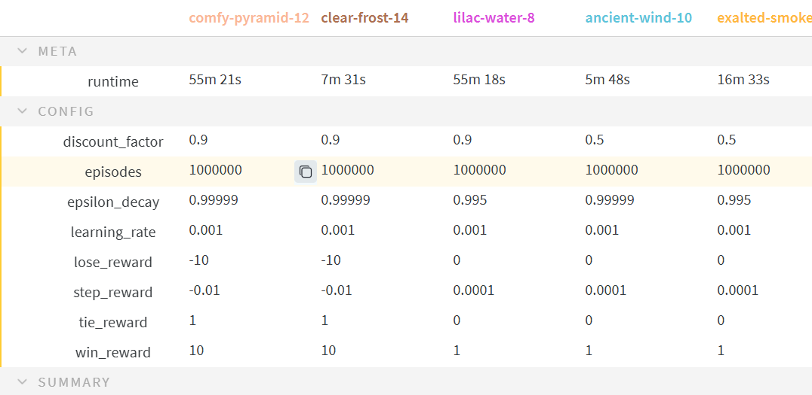

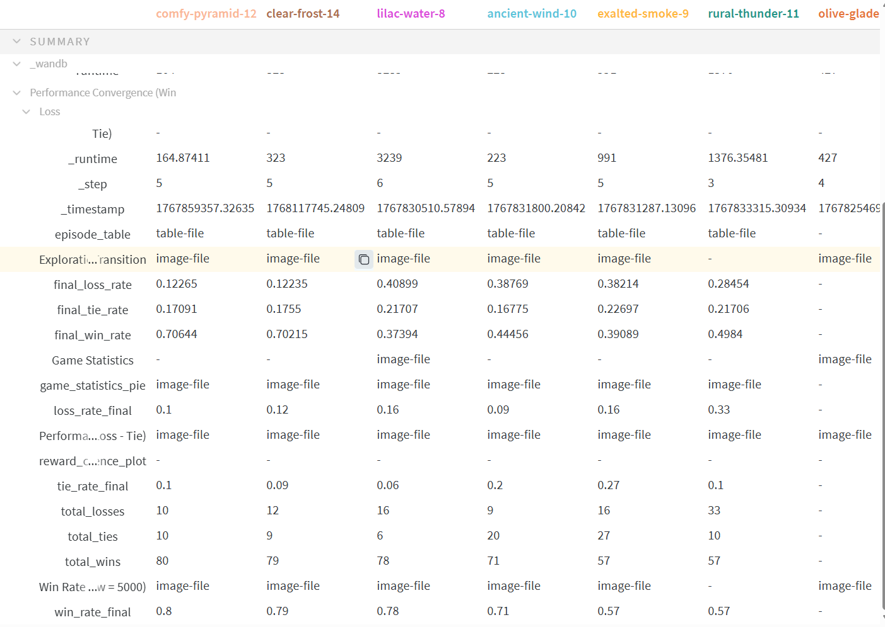

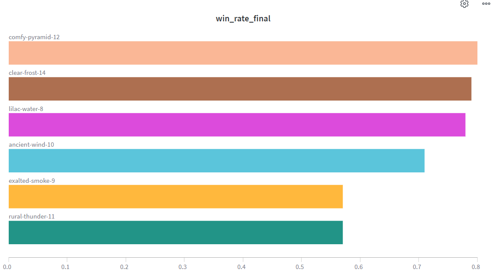

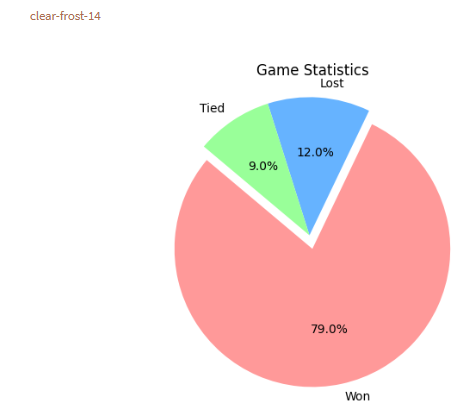

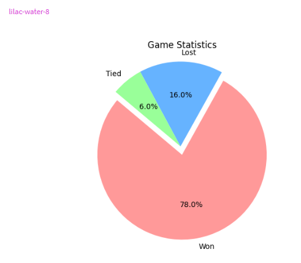

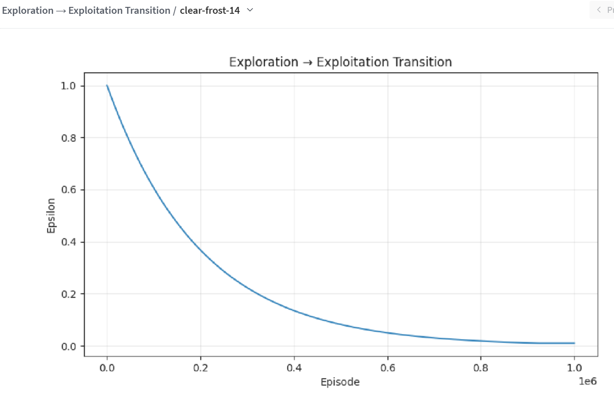

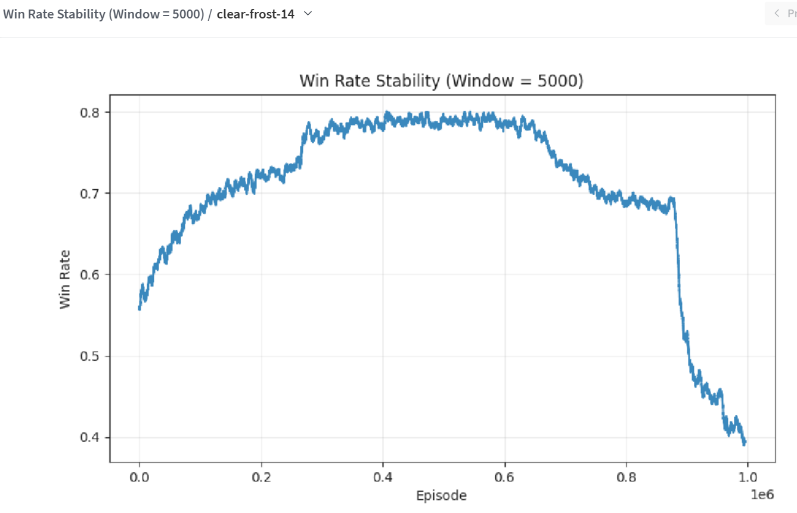

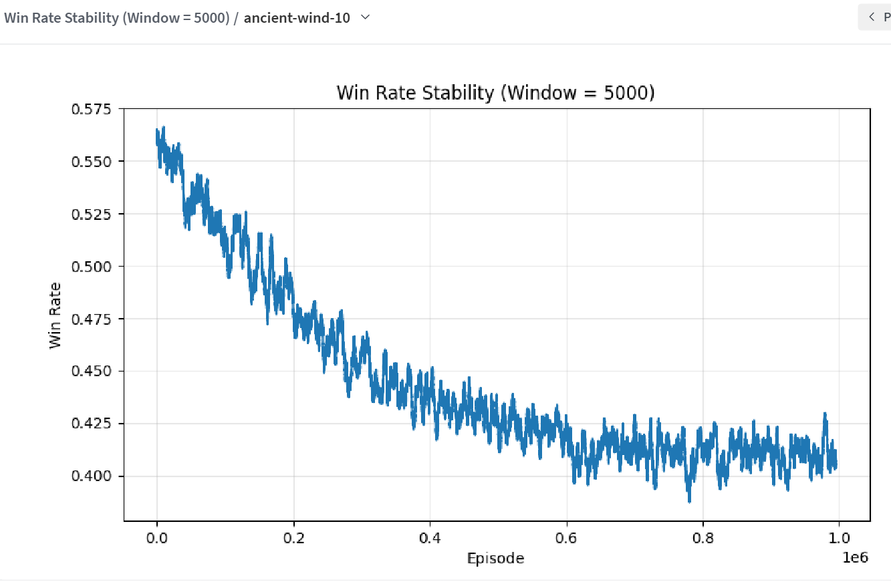

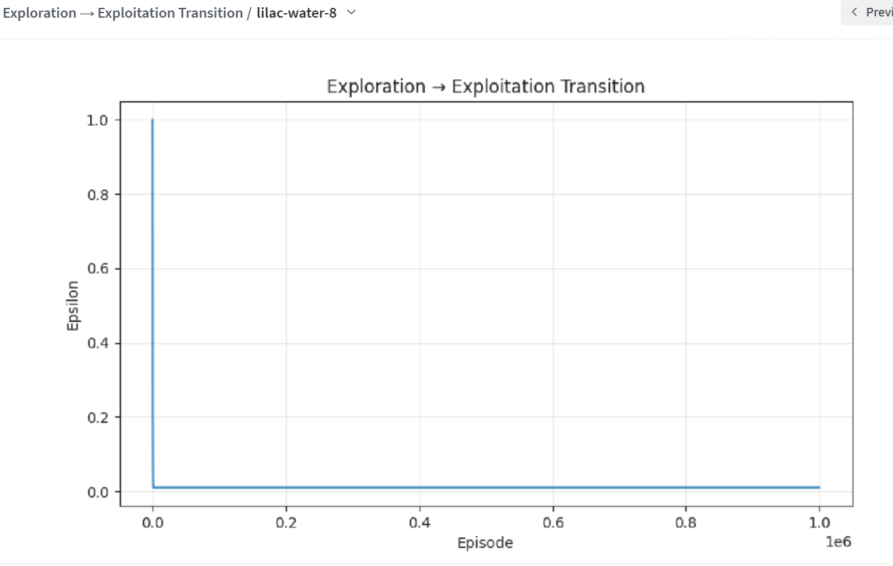

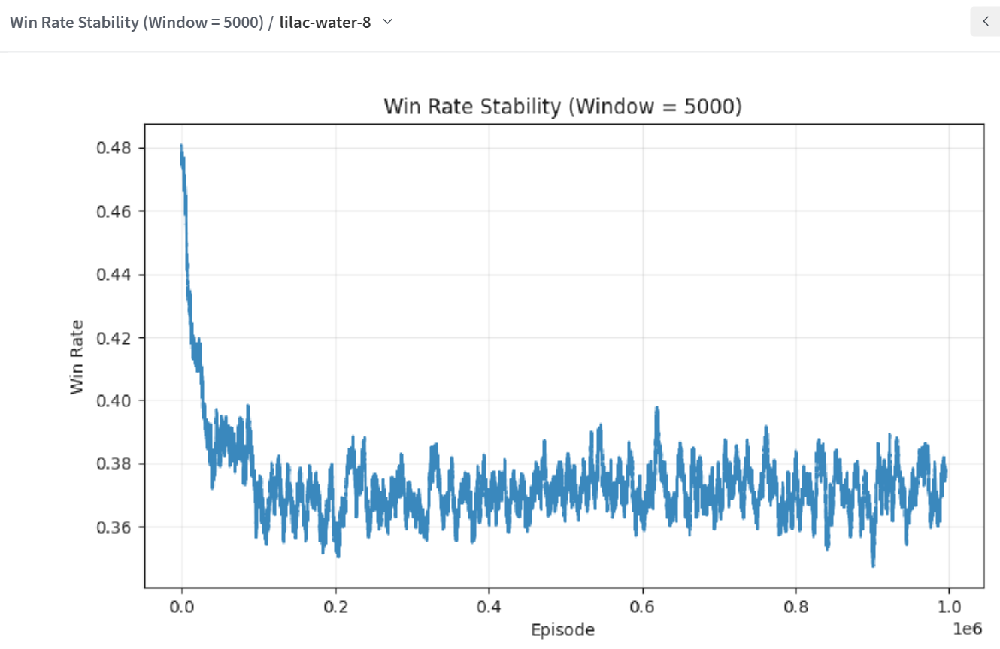

#### b) Learning rate = 0.1 — effect on convergence & stability
- **What your runs show**
  - In the provided W&B runs, `learning_rate` is constant (`0.001`), so we *cannot* empirically attribute differences in win-rate or stability to learning-rate changes from these results.
- **Expected impact (theory / what to look for if you run LR=0.1)**
  - **Convergence speed:** likely faster early learning.
  - **Stability:** typically worse (larger oscillations in the win-rate stability curve and more late-training drift).
  - A practical sign of instability is what you see in `clear-frost-14`: win-rate rises near ~0.79 mid-training and then collapses late; a too-high LR can amplify this kind of collapse.

#### c) Discount factor = 0.9 vs 0.5 — immediate vs future rewards
- **Observed in your runs**
  - `discount_factor=0.9` runs are the top performers (`0.78–0.80` win_rate_final).
  - `discount_factor=0.5` runs are lower (`0.57–0.71` win_rate_final).
- **Important caveat**
  - In these runs, `discount_factor` changes at the same time as other factors (reward magnitudes and epsilon decay), so this is a *correlation* in your experiment set, not a clean isolated causal result.
- **Interpretation**
  - Higher `discount_factor` generally improves longer-horizon planning (blocks/forks) in TicTacToe, which aligns with the stronger outcomes in the `0.9` group.

#### d) Epsilon = 1 — exploration vs exploitation
- **Observed in your runs**
  - All runs start at `epsilon=1`. The *shape* of exploration→exploitation depends on `epsilon_decay`.
  - With `epsilon_decay=0.99999` (e.g., `clear-frost-14`), epsilon decays gradually across the full 1e6 episodes (see the transition plot).
  - With `epsilon_decay=0.995` (e.g., `lilac-water-8`), epsilon reaches `epsilon_min` very early and then stays near-minimum for most of training.
- **Impact on the trade-off**
  - Slow decay maintains exploration longer (can help discover better policies), but may also keep injecting randomness late in training.
  - Fast decay locks into exploitation early; this can stabilize behavior sooner but can also trap the agent in a suboptimal policy.

#### e) Episodes = 10,000,000 — impact on learning outcomes
- **What your runs show**
  - The provided results are at `1,000,000` episodes, not `10,000,000`, so we can’t directly report the 10M outcome.
- **Expected impact at 10,000,000**
  - If the policy is still improving at 1M, more episodes can help it converge.
  - If the policy is already plateaued, more episodes often provide diminishing returns.
  - Over-training is possible with continued exploration or unstable updates; `clear-frost-14` shows a late-training win-rate drop in the stability plot, which is a warning sign that “more episodes” is not always “better” unless exploration/updates are controlled.

#### f) Make tie_reward negative — what happens?
- **What your runs show**
  - In the shown runs, `tie_reward` is `1` (for the top-performing `0.9` group) or `0` (for the others). None of the provided runs uses a negative tie reward, so this answer is based on expected behavior.
- **Expected impact**
  - With `tie_reward < 0`, ties become a penalty.
  - The agent will often prefer riskier lines that attempt to force a win, even when the “safe” optimal action is to secure a draw.
  - Practically, this tends to reduce tie-rate but can increase loss-rate and reduce overall win-rate against a competent opponent.

---

### 3) DQN

#### a) Where/how the neural network is integrated into Q-learning + pros/cons
- **Classic Q-learning:** stores `Q(s,a)` explicitly in a table.
- **DQN replacement:** approximate `Q(s,a; θ)` with a neural network.
  - **Where it fits:**
    - Instead of `q_table[state][action]`, you call `model.predict(state)` to get a vector of Q-values for all actions.
    - You still apply the Bellman target, but you train the network weights `θ` via gradient descent.
  - **How it appears in your notebook (`DQNAgent`):**
    - `act(...)` uses `self.model.predict(state)` and selects the max-Q action among valid moves.
    - `remember(...)` stores transitions in `replay_memory`.
    - `replay(...)` samples a minibatch, builds targets using the Bellman update, and fits the NN.
    - `target_model` stabilizes training by providing a slowly-changing target for the bootstrap.

**Advantages**
- Generalizes across similar states (especially useful when state-space is large).
- Avoids storing huge Q-tables.
- Can handle continuous/large observation spaces (not just discrete boards).

**Disadvantages**
- More hyperparameters and tuning complexity.
- Training instability (bootstrapping + function approximation); needs replay buffer + target network.
- More compute and can be sample-inefficient vs table-based methods on small discrete problems.

#### b) Proposed DQN architecture for TicTacToe + integrated `_build_model(self)`

**State representation (as used in your notebook):**
- Board is flattened to length 9, encoded as:
  - empty = 0
  - X = 1
  - O = -1

**Model architecture (MLP, suitable for small discrete board):**
- **Input:** shape `(9,)`
- **Dense(128, relu)**
- **Dropout(0.10)** (regularization; optional but helps avoid brittle overfitting)
- **Dense(128, relu)**
- **Dense(64, relu)**
- **Output:** **Dense(9, linear)** producing one Q-value per board position
- **Loss:** Huber (more robust than MSE to outliers in TD targets)
- **Optimizer:** Adam with `learning_rate = self.learning_rate`

**Result (what you should see):**
- `model.predict(state)` returns a `(1, 9)` vector of Q-values.
- `act(...)` chooses the highest predicted Q among available moves.
- With replay + target network, learning becomes more stable than naive online Q-learning with a NN.

#### Observed DQN results (from your attached visuals)

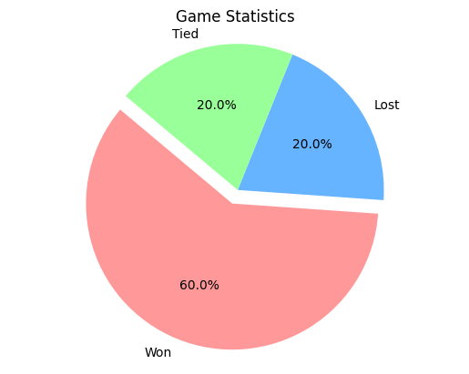

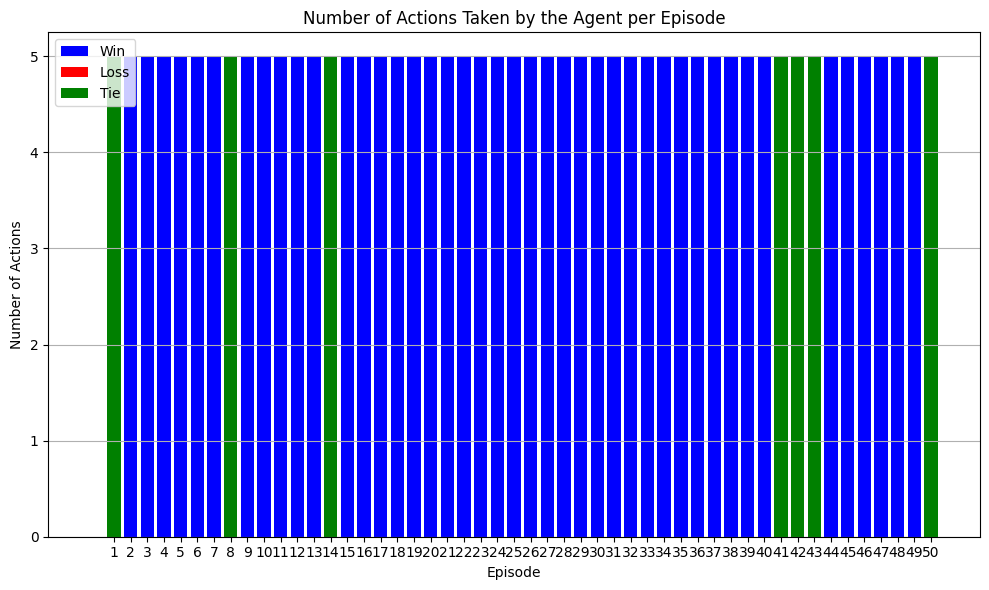

- **Game outcome distribution**
  - The pie chart shows a majority of games won (about `60%`), with the remaining split between losses and ties (about `20%` each).
- **Behavior during play**
  - The “actions per episode” plot indicates the agent often takes a similar number of actions per episode (frequently `5`), which is consistent with games terminating quickly (either by win or by reaching late-board states).
  - The mix of win/tie/loss colors across episodes suggests the learned policy is not fully stable/optimal yet (TicTacToe optimal play tends to converge toward many ties against a strong opponent).

---

## W&B observations referenced
- **Final win-rate comparison:** runs in your screenshots show best-performing configurations near ~0.78–0.79 win-rate and lower-performing around ~0.57.
- **Discount factor trend:** runs using a higher discount (e.g., 0.9) outperform lower discount (e.g., 0.5) in final win-rate.
- **Policy metrics:** q_table size grows and then slows; policy entropy rises and then stabilizes, consistent with convergence and with multiple near-optimal actions in symmetric states.
- **DQN evaluation visuals:** the attached DQN plots show a win-heavy outcome distribution and relatively consistent number of agent actions per episode.
